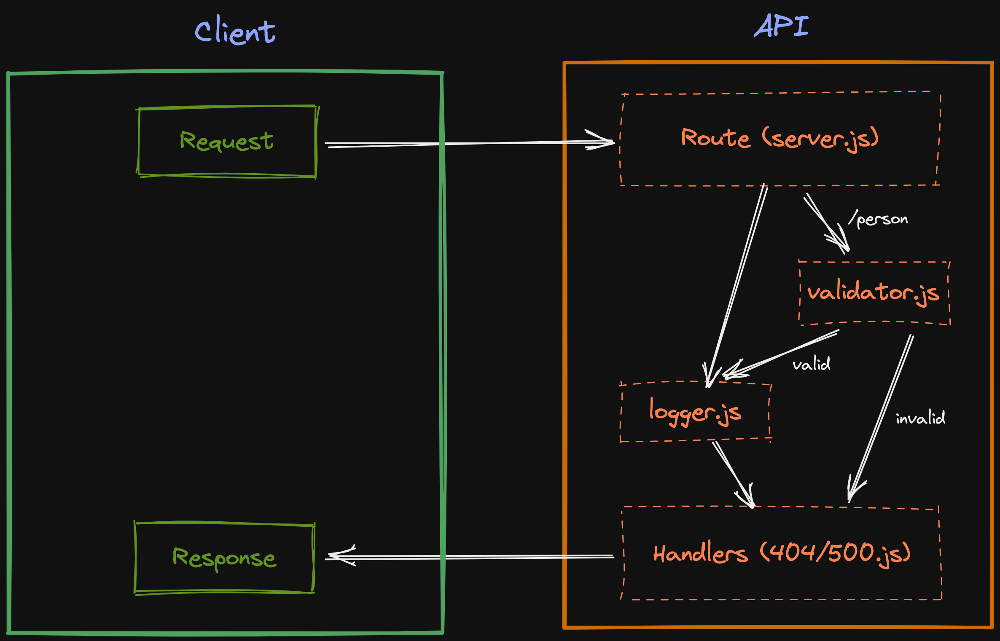

# Lab - Class 02

## Project: Basic Express Server

### Author: Julian Barker

### Problem Domain  

This repo is an exercise in creating and deploying an Express server. It includes basic testing, error handling, and middleware.

### Links and Resources

- [ci/cd](https://github.com/julian-barker/basic-express-server/actions)
- [deployment](https://four01-basic-express-server.onrender.com)

### Setup

#### `.env` requirements (where applicable)

- `PORT` - 3001

#### How to initialize/run your application (where applicable)

- concurrently \"npx tsc --watch\" \"nodemon -q dist/index.js\"

#### Features / Routes

- GET : `/` - return "We're live!!!"
- GET : `/person` - 500 error
- GET : `/person:name` - 'H3ll0, *name*'
- GET : `/bad` - 500 error
- GET : `*` - 404 error

#### Tests

- npm test

#### UML

### Attributions

- Info on build and dev commands with TS was received from [this LogRocket Blog Post](https://blog.logrocket.com/how-to-set-up-node-typescript-express/)
- Info on express types recieved from official [GitHub repo](https://github.com/DefinitelyTyped/DefinitelyTyped/blob/master/types/express/index.d.ts)
